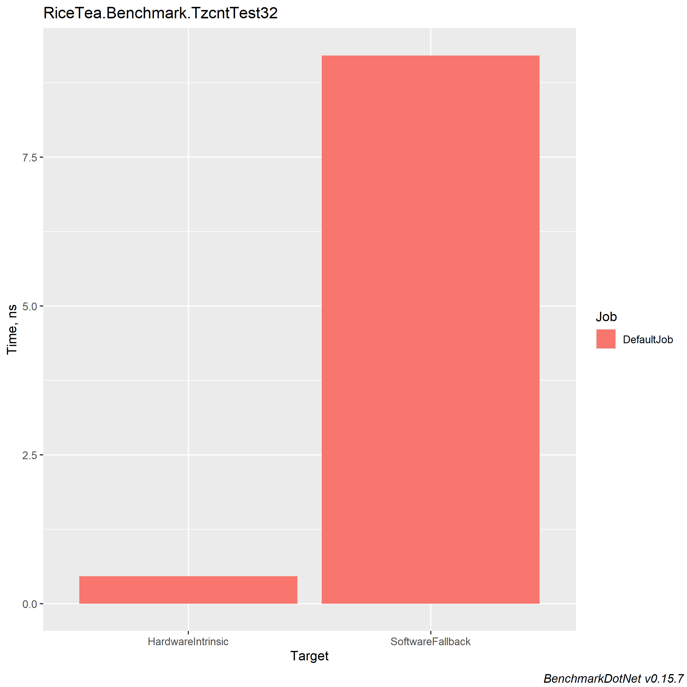
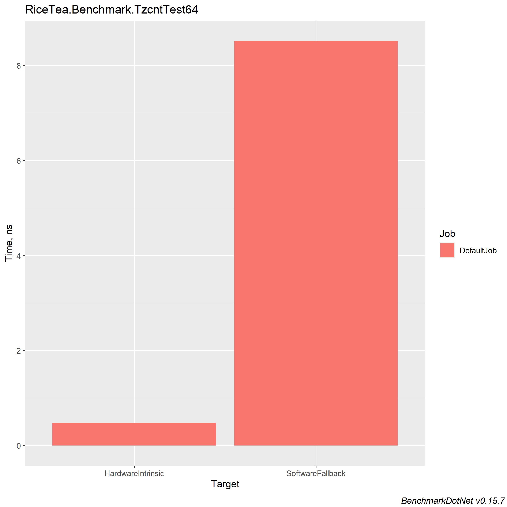
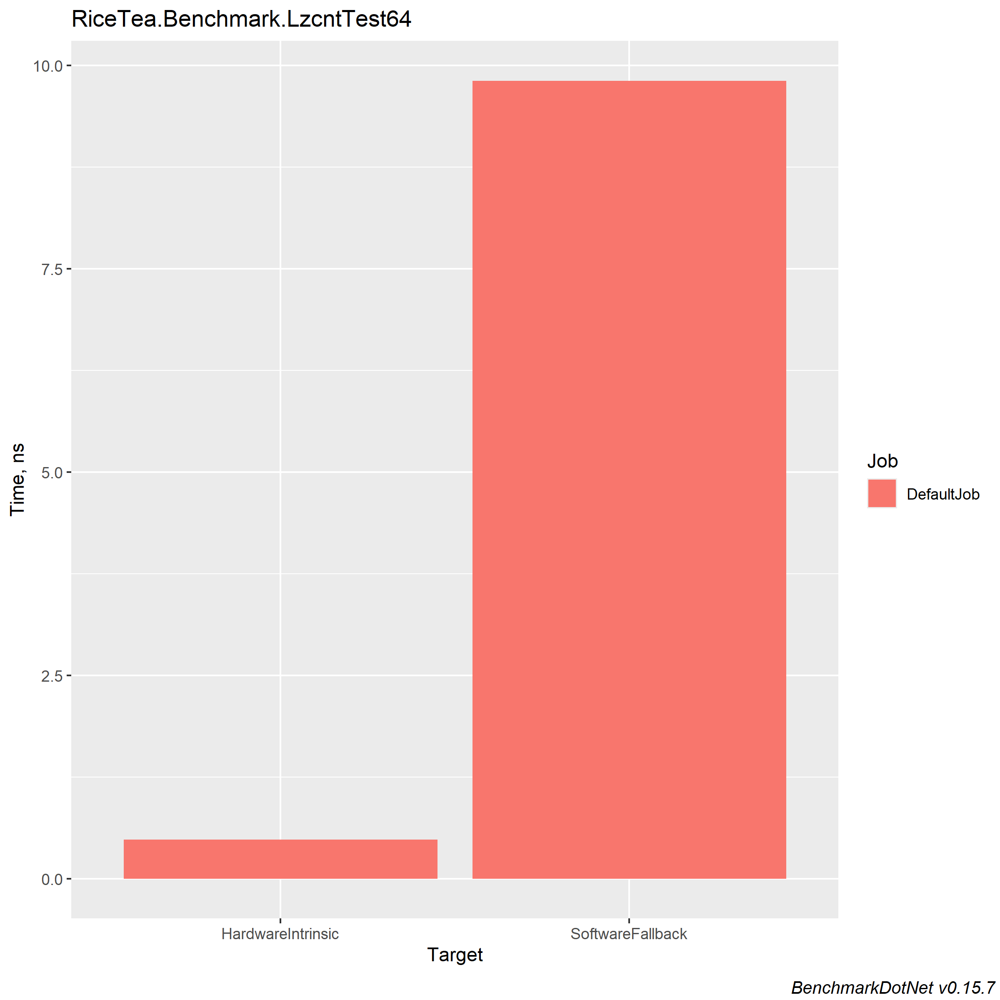
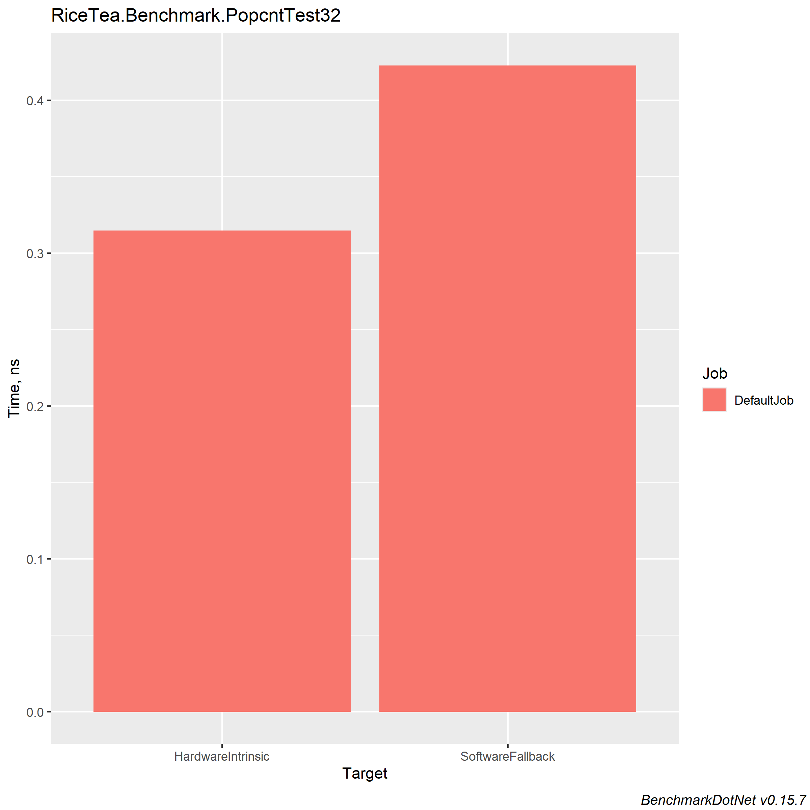
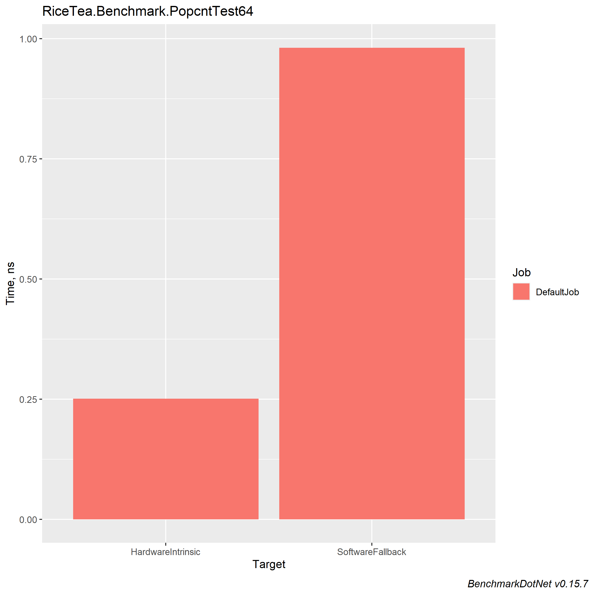

# RiceTea.Backport.System.Runtime.Intrinsics

Provides APIs for accessing processor specific instructions. (backports to .NET Standard 2.0 by Rice Tea)<br/>
<br/>
Only implements those APIs that I may use<br/>
<br/>
## Provides those types and methods:
- System.Runtime.Intrinsics.X86.Bmi1
  - TrailingZeroCount
- System.Runtime.Intrinsics.X86.Bmi1.X64
  - TrailingZeroCount
- System.Runtime.Intrinsics.X86.Lzcnt
  - LeadingZeroCount
- System.Runtime.Intrinsics.X86.Lzcnt.X64
  - LeadingZeroCount
- System.Runtime.Intrinsics.X86.Popcnt
  - PopCount
- System.Runtime.Intrinsics.X86.Popcnt.X64
  - PopCount
- System.Runtime.Intrinsics.X86.X86Base
  - CpuId
  - BitScanForward
  - BitScanReverse
  - DivRem
  - Pause
- System.Runtime.Intrinsics.X86.X86Base.X64
  - CpuId
  - BitScanForward
  - BitScanReverse
  - DivRem

## Performances
### Environment: 
```
CPU: Intel Core(TM) i7-10700F @ 2.90GHz
.NET version: .NET Framework 4.8.1 x64
BDN version: 0.15.7
```
### Bmi1.TrailingZeroCount:

### Bmi1.X64.TrailingZeroCount:

### Lzcnt.LeadingZeroCount:

### Lzcnt.X64.LeadingZeroCount:

### Popcnt.PopCount:

### Popcnt.X64.PopCount:
